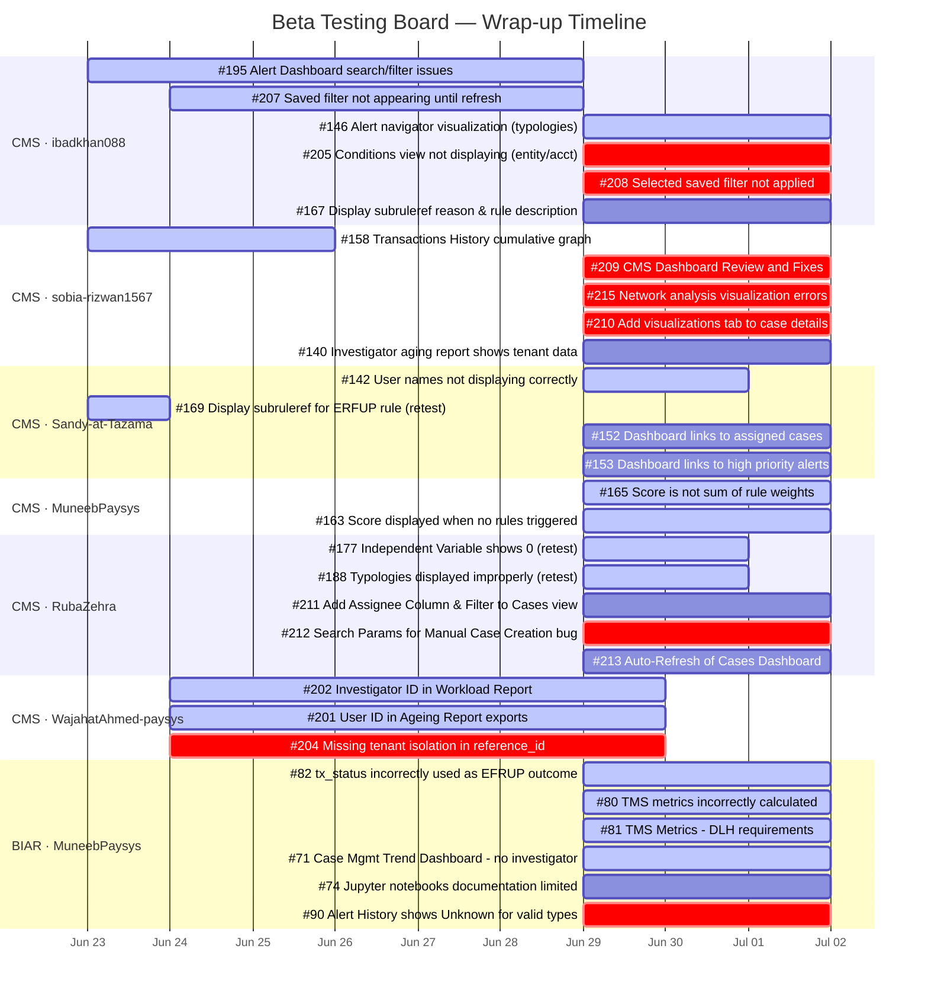

# Beta Testing Issue Tracking — Status Report
**Board:** [tazama-lf/projects/20](https://github.com/orgs/tazama-lf/projects/20/views/1)
**Report Date:** 2026-06-29
**Deadline:** 2026-07-02 (3 days to close)

---

## Summary

| Status | Count |
|---|---|
| ✅ Done | 7 |
| 🔄 In Progress | 10 |
| 🔁 Retest | 5 |
| 🔍 Internal Review | 3 |
| 📋 Todo | 15 |
| **Total** | **40** |

**Open issues:** 33 | **Closed issues:** 7

---

## Issues by Status

### ✅ Done (7)

| # | Title | Repo | Assignee | Closed |
|---|---|---|---|---|
| [#197](https://github.com/tazama-lf/case-management-system/issues/197) | CMS feature request: add link to alert from case details | CMS | Sandy-at-Tazama | 2026-06-24 |
| [#141](https://github.com/tazama-lf/case-management-system/issues/141) | CMS Bug - total cases on dashboard does not correspond to detailed view | CMS | Justus-at-Tazama | 2026-06-24 |
| [#133](https://github.com/tazama-lf/case-management-system/issues/133) | CMS Bug: Active cases requiring attention don't tie up to detailed view | CMS | Sandy-at-Tazama | 2026-06-24 |
| [#138](https://github.com/tazama-lf/case-management-system/issues/138) | CMS feature request: add assigned user to sub-case in case details view | CMS | Sandy-at-Tazama | 2026-06-24 |
| [#180](https://github.com/tazama-lf/case-management-system/issues/180) | Evaluation JSON addition on Alert Details window | CMS | Sandy-at-Tazama | 2026-06-24 |
| [#199](https://github.com/tazama-lf/case-management-system/issues/199) | Investigations bug: total value currency mismatch | CMS | Sandy-at-Tazama | 2026-06-24 |
| [#198](https://github.com/tazama-lf/case-management-system/issues/198) | Investigations feature request: Display transaction time | CMS | Sandy-at-Tazama | 2026-06-24 |
| [#137](https://github.com/tazama-lf/case-management-system/issues/137) | CMS feature request: view evaluation result with alert from alert | CMS | Sandy-at-Tazama | 2026-06-24 |

> Note: #137 appears in Done status on the board but GitHub shows it closed on 2026-06-24.

---

### 🔄 In Progress (10)

| # | Title | Repo | Assignee | Start | End |
|---|---|---|---|---|---|
| [#146](https://github.com/tazama-lf/case-management-system/issues/146) | Alert navigator visualization not showing alerted typologies/rules | CMS | ibadkhan088 | — | — |
| [#158](https://github.com/tazama-lf/case-management-system/issues/158) | Transactions History cumulative value graph has no data | CMS | sobia-rizwan1567 | 2026-06-23 | 2026-06-26 |
| [#165](https://github.com/tazama-lf/case-management-system/issues/165) | The "score" is not the sum of the rule weights | CMS | MuneebPaysys | — | — |
| [#163](https://github.com/tazama-lf/case-management-system/issues/163) | Score value displayed when no rules are triggered | CMS | MuneebPaysys | — | — |
| [#82](https://github.com/tazama-lf/biar/issues/82) | DLH BUG: tx_status incorrectly used as EFRUP block/override outcome | BIAR | MuneebPaysys | — | 2026-06-24 |
| [#80](https://github.com/tazama-lf/biar/issues/80) | DLH BUG: TMS metrics incorrectly calculated | BIAR | MuneebPaysys | — | 2026-06-24 |
| [#81](https://github.com/tazama-lf/biar/issues/81) | TMS Metrics - DLH requirements | BIAR | MuneebPaysys | — | 2026-06-24 |
| [#71](https://github.com/tazama-lf/biar/issues/71) | BIAR Bug: Case Management Trend Dashboard - no investigator data | BIAR | MuneebPaysys | — | 2026-06-24 |
| [#74](https://github.com/tazama-lf/biar/issues/74) | BIAR feedback: Jupyter notebooks documentation very limited | BIAR | MuneebPaysys | — | 2026-06-24 |
| [#195](https://github.com/tazama-lf/case-management-system/issues/195) | Multiple issues with Alert Dashboard search and filtering | CMS | ibadkhan088 | 2026-06-23 | 2026-06-29 |
| [#207](https://github.com/tazama-lf/case-management-system/issues/207) | Newly Saved Filter Does Not Appear Until Page Refresh | CMS | ibadkhan088 | 2026-06-24 | 2026-06-29 |

---

### 🔁 Retest (5)

| # | Title | Repo | Assignee | End Date |
|---|---|---|---|---|
| [#142](https://github.com/tazama-lf/case-management-system/issues/142) | Tazama tenant user names not displaying correctly (showing user ID) | CMS | Sandy-at-Tazama | 2026-06-24 |
| [#169](https://github.com/tazama-lf/case-management-system/issues/169) | Display the subruleref for the ERFUP rule | CMS | Sandy-at-Tazama, ibadkhan088 | 2026-06-24 |
| [#177](https://github.com/tazama-lf/case-management-system/issues/177) | Independent Variable shows 0 for some typologies | CMS | RubaZehra | — |
| [#188](https://github.com/tazama-lf/case-management-system/issues/188) | Typologies Displayed Improperly in CMS Alert Details Modal | CMS | RubaZehra | — |

---

### 🔍 Internal Review (3)

| # | Title | Repo | Assignee | Start | End |
|---|---|---|---|---|---|
| [#202](https://github.com/tazama-lf/case-management-system/issues/202) | Investigator column shows ID instead of name in Workload Report | CMS | WajahatAhmed-paysys | 2026-06-24 | 2026-06-30 |
| [#201](https://github.com/tazama-lf/case-management-system/issues/201) | Investigator column shows User ID instead of name in Ageing Report | CMS | WajahatAhmed-paysys | 2026-06-24 | 2026-06-30 |
| [#204](https://github.com/tazama-lf/case-management-system/issues/204) | Missing tenant isolation in `reference_id` table exposes data across tenants | CMS | WajahatAhmed-paysys | 2026-06-24 | 2026-06-30 |

---

### 📋 Todo (15)

| # | Title | Repo | Assignee | Type |
|---|---|---|---|---|
| [#205](https://github.com/tazama-lf/case-management-system/issues/205) | Investigations bug: conditions view not displaying conditions for entity/account | CMS | ibadkhan088 | Bug |
| [#209](https://github.com/tazama-lf/case-management-system/issues/209) | CMS Dashboard Review and Fixes | CMS | sobia-rizwan1567 | Bug |
| [#215](https://github.com/tazama-lf/case-management-system/issues/215) | CMS Bug: Network analysis visualization errors | CMS | sobia-rizwan1567 | Bug |
| [#210](https://github.com/tazama-lf/case-management-system/issues/210) | CMS bug: add visualizations tab to the case details | CMS | sobia-rizwan1567 | Bug |
| [#140](https://github.com/tazama-lf/case-management-system/issues/140) | CMS bug - investigator case aging report shows entire tenant data | CMS | sobia-rizwan1567 | Bug |
| [#167](https://github.com/tazama-lf/case-management-system/issues/167) | Display subruleref reason and rule description next to sub-ref/rule id fields | CMS | ibadkhan088 | Feature |
| [#152](https://github.com/tazama-lf/case-management-system/issues/152) | CMS feature: dashboard links to cases assigned to you | CMS | Sandy-at-Tazama | Feature |
| [#153](https://github.com/tazama-lf/case-management-system/issues/153) | CMS feature: dashboard links to high priority alerts | CMS | Sandy-at-Tazama | Feature |
| [#90](https://github.com/tazama-lf/biar/issues/90) | Alert History displays Unknown for valid alert types | BIAR | MuneebPaysys | Bug |
| [#208](https://github.com/tazama-lf/case-management-system/issues/208) | Selected Saved Filter Is Not Applied | CMS | ibadkhan088 | Bug |
| [#211](https://github.com/tazama-lf/case-management-system/issues/211) | CMS feature: Cases Dashboard - Add Assignee Column and Filter | CMS | RubaZehra | Feature |
| [#212](https://github.com/tazama-lf/case-management-system/issues/212) | CMS bug: Search Parameters for Manual Case Creation | CMS | RubaZehra | Bug |
| [#213](https://github.com/tazama-lf/case-management-system/issues/213) | CMS feature: Auto-Refresh of the Cases Dashboard | CMS | RubaZehra | Feature |

---

## Issues by Repository

| Repo | Total | Open | Done |
|---|---|---|---|
| case-management-system (CMS) | 34 | 27 | 7 |
| biar (BIAR) | 6 | 6 | 0 |

---

## Issues by Assignee

| Assignee | Total | Done | In Progress | Retest | Internal Review | Todo |
|---|---|---|---|---|---|---|
| Sandy-at-Tazama | 10 | 7 | 0 | 2 | 0 | 2 |
| ibadkhan088 | 7 | 0 | 3 | 1 | 0 | 3 |
| sobia-rizwan1567 | 5 | 0 | 2 | 0 | 0 | 3 |
| MuneebPaysys | 8 | 0 | 5 | 0 | 0 | 1 |
| WajahatAhmed-paysys | 3 | 0 | 0 | 0 | 3 | 0 |
| RubaZehra | 4 | 0 | 0 | 2 | 0 | 3 |
| Justus-at-Tazama | 1 | 1 | 0 | 0 | 0 | 0 |

---

## Gantt Chart — Remaining 3 Days (Jun 29 – Jul 2)

> **Legend:** `active` = In Progress / Retest / Internal Review · `crit` = Todo bugs (highest priority) · plain = Todo feature requests

---

## Risk Assessment

### 🔴 High Risk — 33 open issues, 3-day window

- **MuneebPaysys** carries the heaviest load: 6 open BIAR issues + 2 CMS issues all without Start Dates, likely not yet started.
- **sobia-rizwan1567** has 5 open issues, 3 of which are in Todo with no dates assigned.
- **#204 Tenant isolation bug** (WajahatAhmed) is a security-critical issue currently in Internal Review — must not ship without closure.
- **#142, #169, #177, #188** are in Retest — these are close to done but need sign-off before the deadline.
- All 4 BIAR issues (#80, #81, #82, #71) had End Date of 2026-06-24 and are **already overdue**.

### 🟡 Recommended Actions for Jul 2 Deadline

1. **Immediately triage** the 15 Todo items — assign start dates and confirm scope for the 3-day window.
2. **Escalate BIAR overdue items** (#80, #81, #82, #71) — they missed their 2026-06-24 target.
3. **Fast-track Retest items** (#142, #169, #177, #188) — these are the lowest effort to close.
4. **Defer lower-priority feature requests** (#152, #153, #211, #213) if capacity is tight — they are not bugs.
5. **Confirm #204 tenant isolation fix** passes internal review before merge — security issue.
