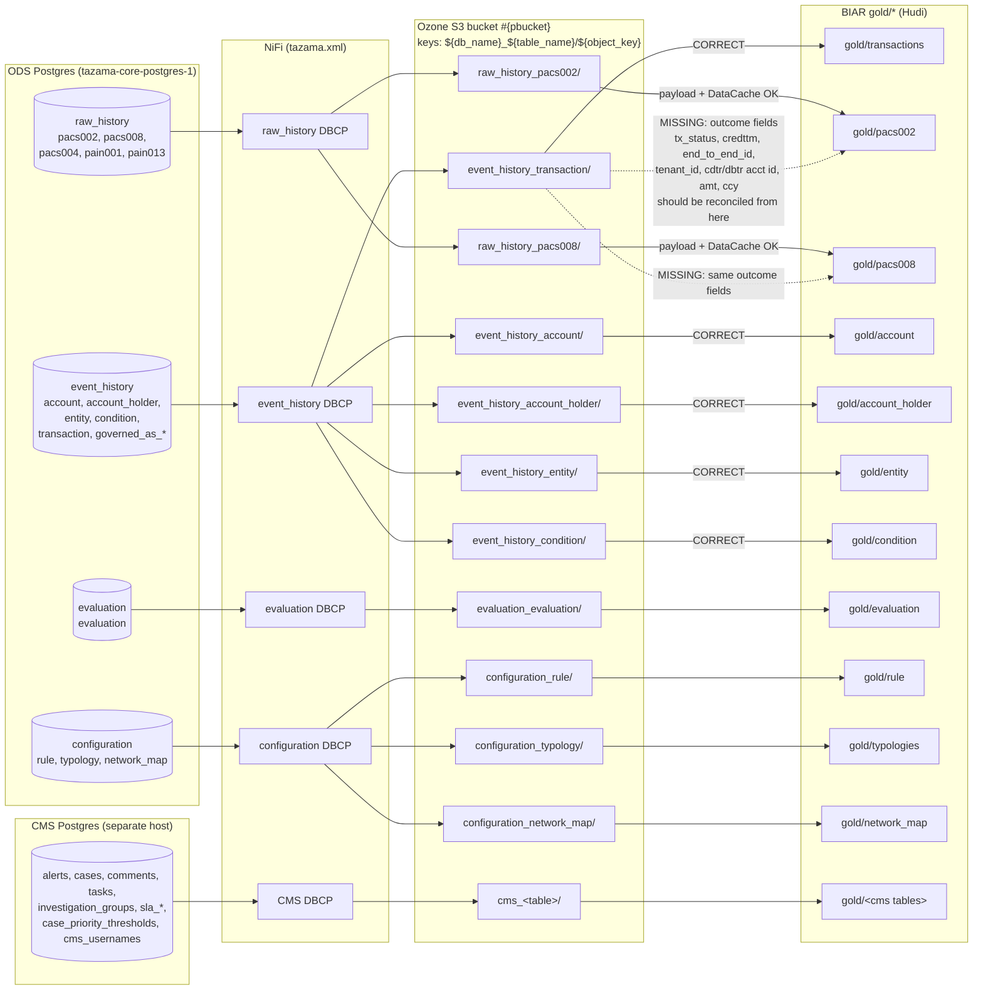

# Source-of-Truth Audit: BIAR Gold Layer Lineage vs. `event_history`

**Author:** Ahmad Khalid (`ahmad.khalid@paysyslabs.com`)
**Date:** 2026-07-16
**Scope:** BIAR lakehouse `gold/*` tables produced by [solutions/biar/automation-orchestrator/Table_ETLs/](../solutions/biar/automation-orchestrator/Table_ETLs/), traced back through the NiFi flow at [solutions/biar/nifi/tazama.xml](../solutions/biar/nifi/tazama.xml) to the ODS Postgres cluster on host `tazama-a`.

---

## 0. What the Client Actually Asked (Framing)

The client is **not** asking us to source gold live from Postgres. Everyone agrees the pipeline is `ODS Postgres → NiFi → Ozone S3 → Spark → Hudi bronze/silver/gold`, and that is fine.

The client is enforcing a **lineage / provenance rule**:

> If a gold field carries transaction-related state (or any data that also exists in `event_history`), the upstream Ozone dump feeding that ETL must be the one produced from `event_history` — **not** from `raw_history` (the ISO 20022 message archive), and not from any other DB. `event_history` is the curated, post-TMS event stream; `raw_history` is the pre-TMS message archive. They overlap but they are not the same. `event_history` is authoritative for transaction *outcome* state.

The bug the client suspects is that developers were lazy: instead of waiting for an `event_history`-sourced dump, some ETLs read outcome-carrying fields off the `raw_history` dump because that dump was already in Ozone. This yields silently divergent gold data.

**Verdict up front (one line):** The suspicion is partially correct. `gold/pacs002` and `gold/pacs008` pull **both** the raw ISO 20022 payload **and** the transaction outcome fields (status, amount, tenant, acct IDs, credttm) from the `raw_history` dump. The outcome fields overlap with — but are not sourced from — `event_history.transaction`. Every other gold table with an `event_history` equivalent (`gold/account`, `gold/account_holder`, `gold/entity`, `gold/condition`, `gold/transactions`) is already sourced from the correct `event_history` dump. See §6 for the per-table verdict and §7 for the remediation.

---

## 1. Executive Summary

- The Postgres cluster on `tazama-a` (container `tazama-core-postgres-1`, image `postgres:18`) hosts seven application databases: `event_history`, `raw_history`, `evaluation`, `configuration`, `enrichment`, `hasura`, `postgres`.
- The NiFi flow ([solutions/biar/nifi/tazama.xml](../solutions/biar/nifi/tazama.xml)) has **six named DBCP connection pools** — one per business DB — and every `QueryDatabaseTableRecord` processor references exactly one pool. This means the DB → Ozone path is unambiguous **at the NiFi level**: each processor's DBCP service ID resolves to a specific `jdbc:postgresql://.../<db>` URL. The S3 object key is `${db_name}_${table_name}/${object_key}` ([nifi/tazama.xml:11250](../solutions/biar/nifi/tazama.xml#L11250), [nifi/tazama.xml:16118](../solutions/biar/nifi/tazama.xml#L16118), [nifi/tazama.xml:21900](../solutions/biar/nifi/tazama.xml#L21900)), so DB provenance is preserved into Ozone.
- **Lineage-clean gold tables** (already sourced from the correct DB per the client's rule): `gold/transactions`, `gold/account`, `gold/account_holder`, `gold/entity`, `gold/condition` (all from `event_history`); `gold/evaluation` (from `evaluation`); `gold/rule`, `gold/typologies`, `gold/network_map` (from `configuration`); CMS tables from the CMS DB.
- **Lineage-muddled gold tables:** `gold/pacs002` and `gold/pacs008` are sourced from `raw_history.pacs002` and `raw_history.pacs008`. That is correct for the raw ISO 20022 payload and for the pacs-specific DataCache. **But** the same ETLs also emit outcome-shaped fields (`tx_status`, `dc_cdtr_acct_id`, `dc_dbtr_acct_id`, `dc_instd_amt`, `dc_instd_ccy`, `credttm_ts`, `end_to_end_id`, `tenant_id`) that also live in `event_history.transaction`. Today those fields are produced from the raw_history dump. If they drift from `event_history` (e.g. TMS updated `TxSts` after `raw_history` snapshot was frozen), the gold rows will disagree with `gold/transactions`.
- **Live-verified from `event_history.transaction`:** for a pacs.002 row the JSONB contains **only** these 8 keys: `TxTp, MsgId, TxSts, source, CreDtTm, TenantId, EndToEndId, destination`. For a pacs.008 row, add `Amt, Ccy` (10 keys total). There is **no** DataCache, **no** exchange rate, **no** InterbankSettlement amount, **no** charges, **no** status-reason code, **no** debtor/creditor agent MmbId in `event_history`. Those fields are structurally exclusive to `raw_history`.
- **Consequence:** the client's rule can only apply to the *overlapping* outcome fields, not to the pacs-specific fields. The remediation is a hybrid: keep raw_history as the source for pacs002/pacs008 raw payload and DataCache extras, but treat `event_history.transaction` as authoritative for `TxSts`, `EndToEndId`, `TenantId`, `CreDtTm`, `source` (dbtr acct id), `destination` (cdtr acct id), `Amt`, `Ccy`, `MsgId`. Downstream joins should reconcile the two sides on `(EndToEndId, TenantId)` and prefer event_history's TxSts on conflict.

---

## 2. Current Data Flow (Verified)



Dotted lines are the missing lineage the client is asking about: `gold/pacs002` and `gold/pacs008` currently derive outcome fields exclusively from `raw_history_pacs00X/`; they should reconcile those fields against `event_history_transaction/`.

---

## 3. `event_history` DB Inventory (Live-Verified)

Verified via `ssh tazama-a` → `docker exec tazama-core-postgres-1 psql -U postgres -d event_history`. Public schema; 9 tables.

### 3.1 `event_history.public.transaction` — 12,695 rows

PK: `(endtoendid, txtp, tenantid)`. Unique: `(msgid, tenantid)`. JSONB blob under `transaction`; all scalar columns are generated `STORED` from JSONB paths.

| Column | Type | Origin |
|---|---|---|
| `source` | varchar | write (debtor account id, FK → account.id) |
| `destination` | varchar | write (creditor account id, FK → account.id) |
| `transaction` | jsonb | write |
| `endtoendid` | text | `transaction ->> 'EndToEndId'` |
| `amt` | numeric(18,2) | `transaction ->> 'Amt'` |
| `ccy` | varchar | `transaction ->> 'Ccy'` |
| `msgid` | varchar | `transaction ->> 'MsgId'` |
| `credttm` | text | `transaction ->> 'CreDtTm'` |
| `txtp` | varchar | `transaction ->> 'TxTp'` |
| `txsts` | varchar | `transaction ->> 'TxSts'` |
| `tenantid` | text | `transaction ->> 'TenantId'` |

**Actual JSONB payload shape** (live pull):

For a `TxTp = 'pacs.002.001.12'` row, the JSONB has exactly these 8 keys:
```
TxTp, MsgId, TxSts, source, CreDtTm, TenantId, EndToEndId, destination
```

For a `TxTp = 'pacs.008.001.10'` row, add `Amt` and `Ccy` (10 keys total).

**There is no DataCache, no ChrgsInf, no XchgRate, no IntrBkSttlmAmt, no InstdAgt/InstgAgt MmbId, no StsRsnInf.Rsn.Cd inside `event_history.transaction`.** Those fields exist only inside `raw_history.pacs002.document` and `raw_history.pacs008.document`. This is a **hard structural limit** on the client's lineage rule — you cannot source those fields from `event_history` because they are not there.

### 3.2 `event_history.public.account` — 2,732 rows

PK: `(id, tenantid)`. Columns: `id varchar`, `tenantid text`, `credttm text`.

### 3.3 `event_history.public.account_holder` — 2,729 rows

PK: `(source, destination, tenantid)`. Edge: `source` → `entity.id`, `destination` → `account.id`, `credttm timestamptz`.

### 3.4 `event_history.public.entity` — 2,699 rows

PK: `(id, tenantid)`. Columns: `id`, `tenantid`, `credttm timestamptz`.

### 3.5 `event_history.public.condition` — 32 rows

PK: `(id, tenantid)`. JSONB `condition` with generated scalar columns.

### 3.6 Governance edge tables — 10/11/12/16 rows

`governed_as_creditor_account_by`, `governed_as_creditor_by`, `governed_as_debtor_account_by`, `governed_as_debtor_by`. Not currently materialized as gold tables.

---

## 4. Adjacent DBs Used by the Gold Layer

### 4.1 `raw_history` (4 real tables + QA scratch)

- `raw_history.public.pacs008` — 6,359 rows. PK `(endtoendid, tenantid)`. JSONB `document` (full ISO 20022 FIToFICstmrCdtTrf message).
- `raw_history.public.pacs002` — 6,341 rows. PK `(endtoendid, tenantid)`. JSONB `document` (full ISO 20022 FIToFIPmtSts message + a `DataCache` block written by TMS with cdtrAcctId/dbtrAcctId/instdAmt/xchgRate/intrBkSttlmAmt).
- `raw_history.public.pacs004`, `pain001`, `pain013` — 0 rows (unused).
- QA scratch tables (`awstxtp1`, `gt1`, `hello_world`, `mappingfixtest*`, `newendpoint*`, `pull65`, `send00*`, `txtpbuild1point1`, `xmltest2`) — ignore.

### 4.2 `evaluation` (1 table)

- `evaluation.public.evaluation` — 1,084 rows. Unique `(messageid, tenantid)`. JSONB `evaluation`.

### 4.3 `configuration` (12 tables, 3 used by BIAR)

- `configuration.public.rule` — 509 rows.
- `configuration.public.typology` — 496 rows.
- `configuration.public.network_map` — 16 rows.

### 4.4 CMS Postgres (separate host)

Alerts, cases, comments, tasks, investigation_groups, SLA policies/records/thresholds, case_priority_thresholds, cms_usernames. Not on `tazama-a`. See [solutions/case-management-system/](../solutions/case-management-system/).

---

## 5. NiFi Lineage — DB → Ozone Path (Verified from Flow XML)

Each `QueryDatabaseTableRecord` processor names its Postgres table plus a `Database Connection Pooling Service` UUID. Each DBCP service has a JDBC URL. The Ozone `object_key` for the corresponding `PutS3Object` is `${db_name}_${table_name}/${object_key}` ([nifi/tazama.xml:11250](../solutions/biar/nifi/tazama.xml#L11250)).

Verified pool → DB mappings from [nifi/tazama.xml](../solutions/biar/nifi/tazama.xml):

| Pool ID (prefix) | Pool `<name>` | Line | JDBC URL |
|---|---|---|---|
| `c771006b-c695-3e3b` | `raw_history` | [5878](../solutions/biar/nifi/tazama.xml#L5878) | `jdbc:postgresql://10.10.80.18:15432/raw_history` |
| `ce84d264-b285-3b84` | `event_history` | [6074](../solutions/biar/nifi/tazama.xml#L6074) | `jdbc:postgresql://10.10.80.18:15432/event_history` |
| — | `evaluation` | [4643](../solutions/biar/nifi/tazama.xml#L4643) | `jdbc:postgresql://10.10.80.18:15432/evaluation` |
| — | `configuration` | [6270](../solutions/biar/nifi/tazama.xml#L6270) | (configuration) |
| — | `enrichment` | [5056](../solutions/biar/nifi/tazama.xml#L5056) | (enrichment) |

Empirical NiFi processor → DB assignments (spot-verified):

| Ozone table | NiFi `Table Name` | DBCP pool used | Resolves to DB | XML line |
|---|---|---|---|---|
| transaction | `transaction` | `ce84d264-...` | **event_history** | [26383](../solutions/biar/nifi/tazama.xml#L26383) |
| pacs008 | `pacs008` | `c771006b-...` | **raw_history** | [21712](../solutions/biar/nifi/tazama.xml#L21712) |
| pacs002 | `pacs002` | `c771006b-...` | **raw_history** | [35894](../solutions/biar/nifi/tazama.xml#L35894) |
| account | `account` | (event_history pool by group) | **event_history** | [10888](../solutions/biar/nifi/tazama.xml#L10888) |
| account_holder | `account_holder` | (event_history pool by group) | **event_history** | [16884](../solutions/biar/nifi/tazama.xml#L16884) |

Meaning: DB provenance is **guaranteed by the NiFi flow**. There is no ambiguity, no risk of a `raw_history` pacs008 landing in the `event_history_pacs008` bucket path. The label `${db_name}_${table_name}` in the object key is derived from an upstream `SELECT current_database() AS db_name, ... FROM information_schema.columns` inside the discovery flow ([nifi/tazama.xml:17165](../solutions/biar/nifi/tazama.xml#L17165)), which reads from the same DBCP pool as the fetch — the two cannot disagree.

**So the client's "developer got lazy and pointed pacs002 at event_history" scenario cannot happen at the NiFi level.** The issue is not about which S3 path is being read — that is correct. The issue is about **which fields we extract from that path**, and whether those fields ought to be reconciled against an event_history-sourced sibling.

---

## 6. Gold Table Lineage Verdict

| Gold Table | ETL File | S3 Source Path (verified) | Correct per client's rule? | Notes |
|---|---|---|---|---|
| `gold/transactions` | [TransactionsETL.py](../solutions/biar/automation-orchestrator/Table_ETLs/TransactionsETL.py) | `s3a://<bucket>/event_history_transaction/*.json` | **Yes** | Direct from event_history dump. |
| `gold/account` | [AccountETL.py](../solutions/biar/automation-orchestrator/Table_ETLs/AccountETL.py) | `s3a://<bucket>/event_history_account/*.json` | **Yes** | |
| `gold/account_holder` | [Account_HolderETL.py](../solutions/biar/automation-orchestrator/Table_ETLs/Account_HolderETL.py) | `s3a://<bucket>/event_history_account_holder/*.json` | **Yes** | |
| `gold/entity` | [EntityETL.py](../solutions/biar/automation-orchestrator/Table_ETLs/EntityETL.py) | `s3a://<bucket>/event_history_entity/*.json` | **Yes** | |
| `gold/condition` | [ConditionsETL.py](../solutions/biar/automation-orchestrator/Table_ETLs/ConditionsETL.py) | `s3a://<bucket>/event_history_condition/*.json` | **Yes** | |
| `gold/pacs008` | [Pacs008ETL.py](../solutions/biar/automation-orchestrator/Table_ETLs/Pacs008ETL.py) | `s3a://<bucket>/raw_history_pacs008/*.json` | **Partial** | Raw ISO 20022 payload → raw_history is correct. Outcome-overlap fields (`tenant_id`, `end_to_end_id`, `message_id`, `credttm_ts`, `instd_amt`, `instd_ccy`, `dc_cdtr_acct_id`, `dc_dbtr_acct_id`, `dc_instd_amt`, `dc_instd_ccy`) are also derived from this dump — they overlap with `event_history.transaction` (`endtoendid`, `msgid`, `credttm`, `amt`, `ccy`, `source`/`destination`, `tenantid`). Not currently reconciled. |
| `gold/pacs002` | [Pacs002ETL.py](../solutions/biar/automation-orchestrator/Table_ETLs/Pacs002ETL.py) | `s3a://<bucket>/raw_history_pacs002/*.json` | **Partial — worst offender** | Same shape as pacs008 but also carries `tx_status` (from `doc.FIToFIPmtSts.TxInfAndSts.TxSts` at [Pacs002ETL.py:118](../solutions/biar/automation-orchestrator/Table_ETLs/Pacs002ETL.py#L118)). This is exactly the field `event_history.transaction.txsts` was created to be authoritative for. Reading it from raw_history means the gold row is fixed at the moment TMS wrote back to `raw_history`, not the moment the post-TMS event was persisted to `event_history`. If they ever disagree (retries, late updates, replay), `gold/pacs002.tx_status` will lie. |
| `gold/evaluation` | [EvaluationETL.py](../solutions/biar/automation-orchestrator/Table_ETLs/EvaluationETL.py) | `s3a://<bucket>/evaluation_evaluation/*.json` | **N/A (out of scope)** | Different DB, no event_history equivalent. |
| `gold/rule` | [RulesETL.py](../solutions/biar/automation-orchestrator/Table_ETLs/RulesETL.py) | `s3a://<bucket>/configuration_rule/*.json` | **N/A** | |
| `gold/typologies` | [TypologiesETL.py](../solutions/biar/automation-orchestrator/Table_ETLs/TypologiesETL.py) | `s3a://<bucket>/configuration_typology/*.json` | **N/A** | |
| `gold/network_map` | [Netwrok_MapETL.py](../solutions/biar/automation-orchestrator/Table_ETLs/Netwrok_MapETL.py) | `s3a://<bucket>/configuration_network_map/*.json` | **N/A** | |
| `gold/alerts`, `gold/cases`, `gold/comments`, `gold/tasks`, `gold/investigation_groups`, `gold/case_priority_thresholds`, `gold/sla_*`, `gold/cms_usernames` | (see [Table_ETLs/](../solutions/biar/automation-orchestrator/Table_ETLs/)) | `s3a://<bucket>/cms_<table>/*.json` | **N/A** | CMS-domain concepts, no event_history equivalent. |

---

## 7. The pacs002 / pacs008 Crux — Field-by-Field Reconciliation

### 7.1 Fields that overlap with `event_history.transaction`

For each field emitted by `gold/pacs002` and `gold/pacs008`, this table says whether the same field exists in `event_history.transaction` (and therefore should be reconciled per the client's rule).

| Gold field (source of extract in ETL) | Present in `event_history.transaction`? | EH source | Verdict |
|---|---|---|---|
| **gold/pacs002 — from [Pacs002ETL.py](../solutions/biar/automation-orchestrator/Table_ETLs/Pacs002ETL.py)** | | | |
| `tenant_id` ([L46](../solutions/biar/automation-orchestrator/Table_ETLs/Pacs002ETL.py#L46)) | Yes | `tenantid` | Reconcile — outcome-side truth is EH |
| `message_id` (from GrpHdr.MsgId, [L44](../solutions/biar/automation-orchestrator/Table_ETLs/Pacs002ETL.py#L44)) | Yes | `msgid` | Reconcile |
| `end_to_end_id` (from OrgnlEndToEndId, [L45](../solutions/biar/automation-orchestrator/Table_ETLs/Pacs002ETL.py#L45)) | Yes | `endtoendid` | Reconcile — this is the join key |
| `credttm_raw` / `credttm_ts` ([L47,L56](../solutions/biar/automation-orchestrator/Table_ETLs/Pacs002ETL.py#L47)) | Yes | `credttm` (text) | Reconcile |
| `tx_status` ([L118](../solutions/biar/automation-orchestrator/Table_ETLs/Pacs002ETL.py#L118)) | Yes | `txsts` | **Reconcile — this is the crux field** |
| `tx_type` ([L142-146](../solutions/biar/automation-orchestrator/Table_ETLs/Pacs002ETL.py#L142)) | Yes | `txtp` | Reconcile |
| `dc_cdtr_acct_id` ([L107](../solutions/biar/automation-orchestrator/Table_ETLs/Pacs002ETL.py#L107)) | Yes | `destination` (for pacs.002, EH swaps roles vs pacs.008) | Reconcile |
| `dc_dbtr_acct_id` ([L108](../solutions/biar/automation-orchestrator/Table_ETLs/Pacs002ETL.py#L108)) | Yes | `source` | Reconcile |
| `dc_cdtr_id` ([L101](../solutions/biar/automation-orchestrator/Table_ETLs/Pacs002ETL.py#L101)) | **No** | — | Keep raw_history — EH does not store the party-level cdtr entity id |
| `dc_dbtr_id` ([L102](../solutions/biar/automation-orchestrator/Table_ETLs/Pacs002ETL.py#L102)) | **No** | — | Keep raw_history |
| `dc_instd_amt` / `dc_instd_ccy` ([L104-105](../solutions/biar/automation-orchestrator/Table_ETLs/Pacs002ETL.py#L104)) | **Partial** | For pacs.008 rows EH has `Amt`/`Ccy`. For pacs.002 rows EH does **not** carry Amt/Ccy | For pacs.008 join → reconcile. For pacs.002 → keep raw_history. |
| `dc_xchg_rate` ([L106](../solutions/biar/automation-orchestrator/Table_ETLs/Pacs002ETL.py#L106)) | **No** | — | Keep raw_history |
| `dc_intrbk_amt` / `dc_intrbk_ccy` ([L109-110](../solutions/biar/automation-orchestrator/Table_ETLs/Pacs002ETL.py#L109)) | **No** | — | Keep raw_history |
| `dc_cre_dt_tm` ([L103](../solutions/biar/automation-orchestrator/Table_ETLs/Pacs002ETL.py#L103)) | **No** (DataCache.creDtTm is not the same as transaction-level CreDtTm) | — | Keep raw_history |
| `grp_msg_id` / `grp_cre_dt_tm` ([L116-117](../solutions/biar/automation-orchestrator/Table_ETLs/Pacs002ETL.py#L116)) | Partial (msgid, credttm) | `msgid`, `credttm` | These are the pacs.002-group-header versions; EH stores the same info. Reconcile if joined. |
| `accptnc_dt_tm` ([L119](../solutions/biar/automation-orchestrator/Table_ETLs/Pacs002ETL.py#L119)) | **No** | — | Keep raw_history |
| `orgnl_instr_id` ([L120](../solutions/biar/automation-orchestrator/Table_ETLs/Pacs002ETL.py#L120)) | **No** | — | Keep raw_history |
| `status_reason_code` ([L122](../solutions/biar/automation-orchestrator/Table_ETLs/Pacs002ETL.py#L122)) | **No** | — | Keep raw_history |
| `instd_mmb_id` / `instg_mmb_id` ([L123-124](../solutions/biar/automation-orchestrator/Table_ETLs/Pacs002ETL.py#L123)) | **No** | — | Keep raw_history |
| `charge_count`, `charge_total_amount`, `charge_currency_*` ([L131-134](../solutions/biar/automation-orchestrator/Table_ETLs/Pacs002ETL.py#L131)) | **No** | — | Keep raw_history |
| **gold/pacs008 — from [Pacs008ETL.py](../solutions/biar/automation-orchestrator/Table_ETLs/Pacs008ETL.py)** | | | |
| `tenant_id`, `message_id`, `end_to_end_id`, `credttm_ts`, `tx_type` | Yes | as above | Reconcile |
| `instd_amt` / `instd_ccy` ([L150-151](../solutions/biar/automation-orchestrator/Table_ETLs/Pacs008ETL.py#L150)) | Yes for pacs.008 | `amt`, `ccy` | **Reconcile — EH is authoritative** |
| `cdtr_acct_id`, `dbtr_acct_id` ([L163,L168](../solutions/biar/automation-orchestrator/Table_ETLs/Pacs008ETL.py#L163)) | Yes | `destination`, `source` | Reconcile |
| `dc_*` block ([L177-186](../solutions/biar/automation-orchestrator/Table_ETLs/Pacs008ETL.py#L177)) | Same story as pacs002 above | | Reconcile only the overlapping subset |
| `intrbk_amt/ccy`, `xchg_rate`, `cdtr_agt_mmb_id`, `dbtr_agt_mmb_id`, `cdtr_name`, `dbtr_name`, `cdtr_id`, `dbtr_id`, `dbtr_acct_scheme`, `cdtr_acct_scheme`, `charge_*` | **No** in EH | — | Keep raw_history |

### 7.2 Answer to the crux question

**Is `event_history.transaction` a strict superset of what `gold/pacs002` exposes for transaction outcome fields? No.**

`event_history.transaction` covers only the coarse outcome envelope (TxTp, TxSts, MsgId, EndToEndId, TenantId, CreDtTm, source, destination; plus Amt/Ccy for pacs.008). The pacs002 gold table carries a substantial superset of ISO 20022 message detail (DataCache, agents, charges, status reason codes, acceptance timestamps) that `event_history` intentionally does not persist.

**Therefore the correct design is a hybrid, not a switch:**

1. Keep raw_history as the source for the raw ISO 20022 payload and every field that only exists there (`dc_xchg_rate`, `dc_intrbk_*`, `dc_cdtr_id`, `dc_dbtr_id`, `dc_cre_dt_tm`, `accptnc_dt_tm`, `orgnl_instr_id`, `status_reason_code`, `instd_mmb_id`, `instg_mmb_id`, all `charge_*`, all `*_agt_mmb_id`, `cdtr_name`/`dbtr_name`, `*_acct_scheme`).
2. For the outcome-overlap fields (`tx_status`, `end_to_end_id`, `tenant_id`, `message_id`, `credttm_ts`, `tx_type`, `dc_cdtr_acct_id`, `dc_dbtr_acct_id`; plus `dc_instd_amt`/`dc_instd_ccy` for pacs.008), join `gold/pacs002` and `gold/pacs008` against `gold/transactions` on `(end_to_end_id, tenant_id)` and prefer the event_history value. Log a divergence metric when they disagree — this is a real signal (TMS state moved after raw_history was frozen).

Practically: introduce a `silver/pacs002_reconciled` step that reads `silver/pacs002` and left-joins `gold/transactions` on `(end_to_end_id, tenant_id)`, then constructs the gold row using `COALESCE(transactions.txsts, silver.tx_status)` for outcome fields and passing raw-only fields through unchanged. Same shape for pacs008.

---

## 8. Direct Answers to the Client's Four Questions

### Q1 — Which gold tables are currently sourced from a NON-event_history upstream when an event_history-sourced alternative exists?

- **`gold/pacs002`** — sourced from `s3a://<bucket>/raw_history_pacs002/*.json` ([Pacs002ETL.py:34](../solutions/biar/automation-orchestrator/Table_ETLs/Pacs002ETL.py#L34)). For **outcome-overlap fields** (`tx_status`, `end_to_end_id`, `tenant_id`, `message_id`, `credttm_ts`, `dc_cdtr_acct_id`, `dc_dbtr_acct_id`), an event_history-sourced sibling exists (`event_history_transaction/`) and is not consulted.
- **`gold/pacs008`** — sourced from `s3a://<bucket>/raw_history_pacs008/*.json` ([Pacs008ETL.py:72](../solutions/biar/automation-orchestrator/Table_ETLs/Pacs008ETL.py#L72)). For outcome-overlap fields (adds `instd_amt`, `instd_ccy` to the pacs.002 list), an event_history-sourced sibling exists and is not consulted.

No other gold table is muddled. `gold/transactions`, `gold/account`, `gold/account_holder`, `gold/entity`, `gold/condition` are all lineage-clean.

### Q2 — For each such table, what is the exact remediation?

**Not a source-path swap.** The event_history dump does not contain the raw ISO 20022 payload or the pacs-specific DataCache fields — swapping the source would break the ETL. The remediation is an additional reconciliation step:

1. **Do not change the S3 source path.** `gold/pacs002` and `gold/pacs008` must keep reading `raw_history_pacs002/` and `raw_history_pacs008/` for the raw payload.
2. **Add a silver-stage join.** In each ETL, after building the silver DataFrame from raw_history, `left join gold/transactions` (which is already event_history-sourced) on `(end_to_end_id, tenant_id)` and produce a reconciled DataFrame:
   - For overlap fields (`tx_status`, `credttm_ts`, `message_id`, `tx_type`, `dc_cdtr_acct_id`, `dc_dbtr_acct_id`, and — pacs.008 only — `instd_amt`, `instd_ccy`): use `COALESCE(transactions_field, silver_field)`, preferring the EH value.
   - For pacs-only fields (charges, agent MmbIds, status reason code, exchange rate, interbank settlement, DataCache entity IDs, acceptance timestamp, original instruction ID): pass through unchanged from silver.
   - Emit a new column `outcome_source ∈ {'event_history','raw_history_fallback'}` so downstream views can filter/audit.
   - Emit a divergence counter (`raw_tx_status != eh_tx_status`) as a job metric.
3. **No NiFi change required.** DB provenance in NiFi is already correct.
4. **Order-of-operations gotcha:** `gold/transactions` must run before `gold/pacs002` and `gold/pacs008` in [FullETLOrchestrator](../solutions/biar/automation-orchestrator/lakehouse_automation_pipeline.py) — otherwise the join has nothing to reconcile against. Today the ETLs are dispatched via `_route_etl` ([lakehouse_automation_pipeline.py:237](../solutions/biar/automation-orchestrator/lakehouse_automation_pipeline.py#L237)) one at a time from NiFi triggers; the reconciliation should read `gold/transactions` at silver time and tolerate a missing row (fall back to raw_history value, tag `outcome_source='raw_history_fallback'`).

### Q3 — Which gold fields ONLY exist in raw_history and cannot come from event_history?

Verified from live JSONB pulls of `event_history.transaction`:

**pacs.002 side (`gold/pacs002`) — raw_history-only fields:** `dc_cdtr_id`, `dc_dbtr_id`, `dc_cre_dt_tm`, `dc_xchg_rate`, `dc_intrbk_amt`, `dc_intrbk_ccy`, `accptnc_dt_tm`, `orgnl_instr_id`, `status_reason_code`, `instd_mmb_id`, `instg_mmb_id`, `charge_count`, `charge_total_amount`, `charge_currency_count`, `charge_currency_hint`. For pacs.002 rows also: `dc_instd_amt`, `dc_instd_ccy` (EH does not carry Amt/Ccy on pacs.002 records — confirmed live).

**pacs.008 side (`gold/pacs008`) — raw_history-only fields:** `intrbk_amt`, `intrbk_ccy`, `xchg_rate`, `cdtr_agt_mmb_id`, `dbtr_agt_mmb_id`, `cdtr_name`, `cdtr_id`, `cdtr_acct_scheme`, `dbtr_name`, `dbtr_id`, `dbtr_acct_scheme`, `charge_amt`, `charge_ccy`, `charge_agent_mmb_id`, plus the same `dc_*` fields as above minus `dc_instd_amt/ccy` (those ARE in EH for pacs.008).

The client should keep the raw_history pull for these fields specifically.

### Q4 — For "transaction-related" tables (pacs002, pacs008, joins thereto), is the current design sound?

**Almost, but not quite.** The intent — raw_history for message archive, event_history for outcome — is the right architecture. The implementation has two gaps:

1. **The outcome-overlap fields are read from raw_history and never reconciled.** This means `gold/pacs002.tx_status` and `gold/transactions.txsts` can silently disagree for the same `(end_to_end_id, tenant_id)`. That is the exact class of bug the client suspects. Fix per Q2.
2. **Downstream views join across the two families using the wrong keys.** [alert_navigator.py](../solutions/biar/automation-orchestrator/Table_ETLs/alert_navigator.py) and friends join `gold/transactions` (camel-glued `endtoendid`, `tenantid`, `txtp`) to `gold/pacs002`/`gold/pacs008` (snake-cased `end_to_end_id`, `tenant_id`, `tx_type`). See [Table_ETLs/finding-biar-alert-navigator-end-to-end-id.md](../solutions/biar/automation-orchestrator/Table_ETLs/finding-biar-alert-navigator-end-to-end-id.md). Once the reconciliation join in Q2 is added, this naming inconsistency becomes acute — both sides of the join must agree on column names. Standardize on snake_case.

Beyond those two gaps, the raw_history-for-payload / event_history-for-outcome split is the right shape.

---

## 9. Recommendations (Ranked, Scoped)

| # | Action | Blast Radius |
|---|---|---|
| 1 | Add a silver-stage reconciliation join in [Pacs002ETL.silver()](../solutions/biar/automation-orchestrator/Table_ETLs/Pacs002ETL.py#L89) and [Pacs008ETL.silver()](../solutions/biar/automation-orchestrator/Table_ETLs/Pacs008ETL.py) that left-joins `gold/transactions` on `(end_to_end_id, tenant_id)` and coalesces the overlap fields listed in §7.2. Emit `outcome_source` and a divergence metric. | Medium — touches two ETLs + adds an ordering dependency in the orchestrator. No schema break on `gold/transactions`. |
| 2 | Normalize column names on `gold/transactions` to snake_case (`end_to_end_id`, `tx_type`, `tx_status`, `tenant_id`, `message_id`), keep a backwards-compat view for legacy consumers. Precondition for #1's join to work without an ugly rename inside the join. | Medium — every consumer of `gold/transactions`. |
| 3 | Document `outcome_source` semantics in [solutions/biar/data-lineage.md](../solutions/biar/data-lineage.md) so downstream BI users know when a `gold/pacs002` row is EH-reconciled vs raw-fallback. | Small. |
| 4 | Add a NiFi-side assertion that the `${db_name}` attribute stamped into the object key equals the source DB of the DBCP pool that produced the FlowFile — as a defense-in-depth check even though the flow already guarantees it structurally. | Small — one AttributeCheck processor per subflow. |
| 5 | Materialize a `gold/condition_governance` table by unioning the four `governed_as_*` edge tables (49 rows total) so BIAR can reason about condition scoping without walking `transaction` JSONB. Purely additive. | Small. |
| 6 | Delete raw_history QA scratch tables (`awstxtp1`, `gt1`, `hello_world`, `mappingfixtest*`, `newendpoint*`, `pull65`, `send00*`, `txtpbuild1point1`, `xmltest2`) so future audits don't have to disambiguate them. | Small — ODS team sign-off. |

---

## 10. Appendix — How to Reproduce This Audit

### 10.1 Enumerate the Postgres cluster

```
ssh tazama-a 'docker exec tazama-core-postgres-1 psql -U postgres -l'
```

### 10.2 Inspect `event_history.transaction` payload shape

```
ssh tazama-a 'docker exec tazama-core-postgres-1 psql -U postgres -d event_history \
  -c "SELECT jsonb_pretty(transaction) FROM public.transaction WHERE txtp LIKE '\''pacs.002%'\'' LIMIT 1"'

ssh tazama-a 'docker exec tazama-core-postgres-1 psql -U postgres -d event_history \
  -c "SELECT jsonb_pretty(transaction) FROM public.transaction WHERE txtp LIKE '\''pacs.008%'\'' LIMIT 1"'
```

### 10.3 Trace a NiFi processor's source DB

Every `QueryDatabaseTableRecord` processor has a `Database Connection Pooling Service` UUID. Grep the pool UUID in [nifi/tazama.xml](../solutions/biar/nifi/tazama.xml) and find the corresponding `<controllerServices><id>` block — the `<name>` and `Database Connection URL` reveal the DB.

```
grep -n 'Database Connection Pooling Service' solutions/biar/nifi/tazama.xml
grep -n -B2 -A2 '<pool-uuid>' solutions/biar/nifi/tazama.xml
```

The S3 object key for the corresponding `PutS3Object` is stamped as `${db_name}_${table_name}/${object_key}` via `UpdateAttribute` processors (`nifi/tazama.xml` lines [11250](../solutions/biar/nifi/tazama.xml#L11250), [16118](../solutions/biar/nifi/tazama.xml#L16118), [21900](../solutions/biar/nifi/tazama.xml#L21900), [23250](../solutions/biar/nifi/tazama.xml#L23250)). `${db_name}` is set upstream from `SELECT current_database() AS db_name` ([nifi/tazama.xml:17165](../solutions/biar/nifi/tazama.xml#L17165)), so DB provenance is guaranteed structurally.

### 10.4 Static analysis of the BIAR ETLs

```
grep -nE 'def bronze|source_path|read\.json|s3a://' \
     /home/ak/workspace/tazama-uat/solutions/biar/automation-orchestrator/Table_ETLs/*ETL.py
```

Every `bronze()` starts with `self.spark.read.json(source_path)`; every `source_path` is `s3a://{bucket}/{db_name}/{table}/...` per [lakehouse_automation_pipeline.py:161-187](../solutions/biar/automation-orchestrator/lakehouse_automation_pipeline.py#L161).

### 10.5 Enumerate raw_history and event_history table schemas

```
for db in event_history raw_history; do
  ssh tazama-a "docker exec tazama-core-postgres-1 psql -U postgres -d $db -c '\dt public.*'"
done

ssh tazama-a 'docker exec tazama-core-postgres-1 psql -U postgres -d raw_history \
  -c "SELECT jsonb_object_keys(document) FROM public.pacs002 LIMIT 20"'
ssh tazama-a 'docker exec tazama-core-postgres-1 psql -U postgres -d event_history \
  -c "SELECT jsonb_object_keys(transaction) FROM public.transaction LIMIT 20"'
```

---

*End of report.*
