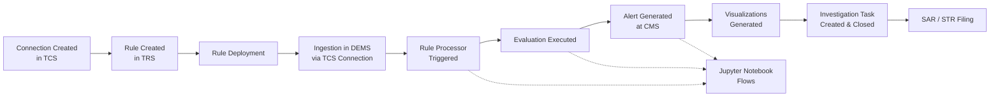
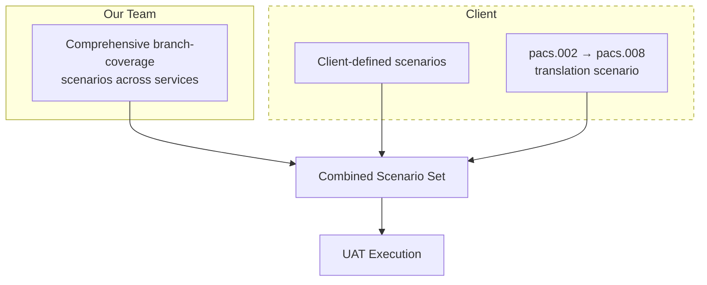
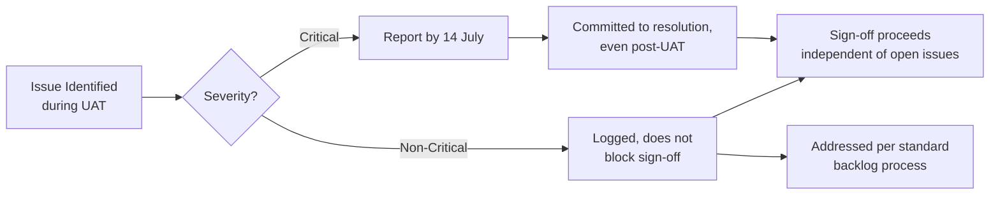

# UAT Scope Definition — Tazama Core + Extension Services

**Status:** Submission for discussion
**Involved Parties:** [Paysys Labs, Tazama]

---

## Table of Contents

- [1. Purpose](#1-purpose)
- [2. Definition of UAT](#2-definition-of-uat)
- [3. End-to-End Scope Coverage](#3-end-to-end-scope-coverage)
- [4. Scenario Ownership & Deadlines](#4-scenario-ownership--deadlines)
- [5. Sign-Off Criteria](#5-sign-off-criteria)
- [6. Issue Handling & Post-UAT Commitment](#6-issue-handling--post-uat-commitment)
- [7. Key Dates Summary](#7-key-dates-summary)
- [8. Additional Considerations](#8-additional-considerations)
- [9. Open Items Requiring Confirmation](#9-open-items-requiring-confirmation)

---

## 1. Purpose

This document defines the scope, boundaries, and success criteria for User Acceptance Testing (UAT) of the Tazama core platform and its extension services. It is intended to align both parties on what UAT covers, how scenarios are sourced, how issues are handled, and what constitutes a valid sign-off.

---

## 2. Definition of UAT

UAT is defined as the execution of agreed test scenarios across the full Tazama core and extension services environment, demonstrating that each step in the transaction/alerting lifecycle behaves as expected. UAT is considered a **functional validation of the end-to-end flow**, not an exhaustive defect-free certification of the system.

---

## 3. End-to-End Scope Coverage

UAT scenarios must exercise the following stages, in sequence, at minimum once per scenario:

1. Connection creation in **TCS** 
2. Rule creation in **TRS** 
3. Rule deployment
4. Ingestion in **DEMS**, via the connection created in TCS
5. Rule Processor triggering for relevant rules
6. Evaluation execution
7. Alert generation at **CMS**
8. CMS-level completion: visualizations generated
9. Investigation task creation and closure
10. SAR/STR filing
11. Jupyter Notebook–related flows

### 3.1 Flow Diagram

A scenario is considered successfully executed when every applicable stage above completes as expected, without requiring manual workaround outside documented process.

---

## 4. Scenario Ownership & Deadlines

- **Paysys Labs team** will bring a set of scenarios intended to be comprehensive enough to exercise each meaningful branch across the services' flows.
- **Tazama** is welcome to bring additional scenarios.
- One scenario already brought up by Tazama: validating that **pacs.002 rules translated to pacs.008** produce consistent system behavior.
- **Deadline for client-submitted scenarios: 10 July** — client to commit to submitting all scenarios by this date so they can be incorporated into the test plan without disrupting the schedule.

### 4.1 Scenario Sourcing Overview

*Client scenarios must be received by 10 July to be included in the combined scenario set above.*

---

## 5. Sign-Off Criteria

- Successful execution of the agreed scenario set — demonstrating that all stages in [Section 3](#3-end-to-end-scope-coverage) work in concert — constitutes grounds for UAT conclusion.
- Once this is demonstrated, **UAT is considered concluded by both parties**, independent of any outstanding issues discovered during testing.
- **Sign-off is not withheld on the basis of bugs.** Tazama agrees not to delay or block sign-off due to defects identified during UAT.
- Target sign-off date: **23 July**

---

## 6. Issue Handling & Post-UAT Commitment

- Paysys Labs commit to resolving any **critical issues** identified on our end, including those found **after UAT has concluded**.
- This commitment is separate from, and does not affect, the sign-off decision.
- **Critical issue reporting threshold (client-side):** issues must be reported by **14 July** to be considered within the committed resolution window.
- Issues reported after this threshold may be handled on a best-effort basis, subject to further discussion.

### 6.1 Issue Lifecycle

---

## 7. Key Dates Summary

| Date | Milestone | Status |
|---|---|---|
| 10 July | Deadline for client to submit their UAT scenarios | pending Tazama confirmation |
| 14 July | Critical issue reporting threshold (client-side) | pending Tazama confirmation |
| 23 July | Target UAT sign-off date | pending Tazama confirmation |

---

## 8. Additional Considerations

The following items are commonly needed to make a UAT scope airtight and may be worth adding before finalizing this document:

- **Entry criteria:** Confirm the environment (core + extension services) is stable, deployed, and data-seeded before UAT execution begins.
- **Environment freeze/change control:** Define whether code/config changes are permitted in the UAT environment during the test window, and how such changes are communicated if unavoidable.
- **Defect severity classification:** Agree on a shared definition of "critical" vs. "non-critical" issues, ideally with examples, so the 14 July threshold and resolution commitment aren't disputed later.
- **Roles & responsibilities:** Who executes scenarios (client vs. our team), who triages issues, and who has authority to confirm sign-off on each side.
- **Communication cadence:** Daily/standing sync during the UAT window for issue triage and status updates.
- **Test data & environment reset:** Whether data can be reset between scenario runs, and who owns that.
- **Evidence/documentation:** What constitutes proof of successful scenario execution (logs, screenshots, recorded walkthrough) for sign-off records.
- **Escalation path:** How disagreements over issue severity or scope are escalated during UAT.
- **Post-sign-off support SLA:** Once critical issues are committed to be fixed post-UAT, define expected turnaround/SLA for those fixes.
- **Regression coverage:** If critical fixes are made post-UAT, confirm whether any lightweight regression check is expected before those fixes are considered closed.

---

## 9. Open Items Requiring Confirmation from Tazama

- Scope and definition of the "critical issue" resolution commitment post-UAT 
- 14 July critical issue reporting threshold 
- 23 July sign-off date 
- Confirm defect severity classification criteria (see [Section 8](#8-additional-considerations))
- Confirm environment freeze policy during UAT window
