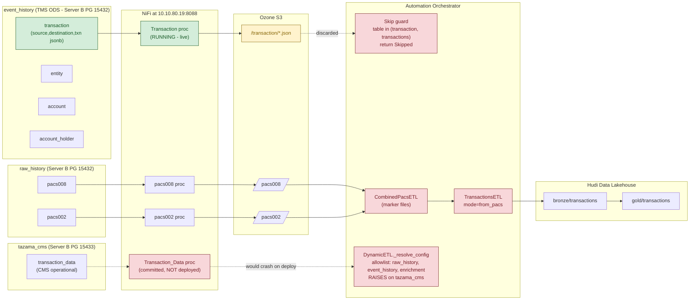

# Combined Impact — biar Issues #108, #109, #110, #111

**Date:** 2026-07-08
**Author:** Ahmad Khalid
**Repository:** tazama-lf/biar
**Verified against:** biar `ef0c856` (dev), frms-coe-lib `513d91d` (dev), case-management-system `2b14c12f` (dev), Full-Stack-Docker-Tazama `e218211` (dev), live NiFi at `http://10.10.80.19:8088`, live JupyterHub at `http://10.10.80.19:8888`.

Single-page overview of the four related biar issues. For per-issue details, see the individual directories under [issues/biar/108/](108/), [109/](109/), [110/](110/), [111/](111/).

---

## One-paragraph summary

`gold/transactions` in the Data Lakehouse is built from the wrong upstream — raw pacs.008 + pacs.002 messages, joined by a marker-file orchestrator (`CombinedPacsETL`) — while the correct upstream (`event_history.transaction`, the TMS-normalised ODS table with FK-validated `source`/`destination` account IDs and flat business fields) is being polled live by NiFi and **explicitly discarded** by a skip guard in the automation orchestrator. Every downstream symptom (missing account IDs, half-null Amt/Ccy/TxSts fields, party names sourced from ISO paths that don't exist on pacs.002 rows, and a five-way naming collision around the identifier `transaction_data`) traces back to this single wrong-source decision. #110 is the root fix. #108 dissolves as a natural consequence. #109 is an unrelated latent hazard in the committed NiFi flow (an orphaned processor with no orchestrator handler). #111 is the coordinated consumer sweep that must land with #110.

---

## Dependency map

**Legend:** red = wrong / broken today, green = correct source waiting to be used, amber = latent hazard.

---

## Per-issue impact at a glance

| Issue | Severity | Fix scope | Merges with |
|---|---|---|---|
| **#108** — `transaction_data` naming collision | Medium (chronic confusion) | No standalone code fix; hardening AC in #110's PR (tighten view-builder candidate lists) | #110 |
| **#109** — `tazama_cms.transaction_data` would crash orchestrator | High (latent) — but zero live impact today | Single-file NiFi cleanup: remove committed `Transaction_Data` processor and its exclusive downstream chain | Independent (ship first) |
| **#110** — `gold/transactions` sources from wrong upstream | High (data quality) | Multi-file rewrite: `TransactionsETL`, orchestrator skip guard, `CombinedPacsETL` deletion, singular table naming, entity-join enrichment | Atomic with #108 Track A + #111 |
| **#111** — 14 downstream consumers | Mixed (Low path-rename × 7, Medium code-refactor × 7) | Consumer sweep: 3 view builders + CMS backend + notebook + DLH API + views orchestrator | Atomic with #110 |

---

## Concrete effects if left unfixed

| Consequence | Traces to |
|---|---|
| `gold/transactions` lacks `source` / `destination` — no clean way to link transactions to accounts or entities | #110 |
| Every pacs.002 row has null `Amt`/`Ccy`; every pacs.008 row has null `TxSts` — analytics silently produce nulls | #110 |
| CMS Transaction Detail shows blank `debtor_name` / `creditor_name` on pacs.002-only rows | #110 + #111 |
| NiFi `Transaction` processor writes to Ozone on every poll cycle; those files are read by nobody | #110 |
| Committed NiFi flow contains a `Transaction_Data` processor whose batches would crash the orchestrator's `DynamicETL` fallback with `RuntimeError`; latent on redeploy | #109 |
| Anomaly Detection notebook uses `instg_mmb_id`/`instd_mmb_id` as **join keys** (not just features) — MVP `gold/transaction` won't have them → notebook breaks unless a view-layer pacs join is added | #111 |
| View-builder candidate detection lists include `"transaction"` as a fallback → after #110 rebuilds `bronze/transaction` with a JSONB payload column literally named `transaction`, view builders would silently pick it up and parse TMS-normalised JSON as ISO 20022, producing all-null rows | #108 |
| Developer confusion: five unrelated things called `transaction_data`/`transactionData` across NiFi, view builders, CMS Prisma, and CMS ODS | #108 |

---

## What the live environment showed

- **NiFi at `10.10.80.19:8088`:** 158 processors, all RUNNING. `transaction` (singular) is live and correctly pulls from `event_history.transaction` on `10.10.80.19:15432`. **No `Transaction_Data` processor is deployed** — the committed XML has one but the live flow does not. Live payload template for `transaction` batches is Template A (`raw_path, bucket, table, object_key, execute_notebook`) — no `db_name` field, so the orchestrator's skip guard triggers before `db_name` is inspected. Result: no crash today from either the transaction route or the (undeployed) transaction_data route.
- **JupyterHub at `10.10.80.19:8888`:** 9 shared notebooks running. All 9 have **drifted** from the copies committed to `biar/JupyterHub/notebooks/` on dev (same or off-by-one cell counts, different content hashes). The Anomaly Detection notebook explicitly uses `instg_mmb_id`/`instd_mmb_id` as join keys in cell 10 lines 440–450 — confirming the MVP schema gap in #111 is real and blocking, not a path rename.
- **CMS Prisma schema (dev):** the CMS `TransactionData` model maps to table `transaction_data` with a nested `Json` column literally called `transactionData` — nested naming collision confirmed. Primary key is `transactionId Int @default(autoincrement())` — noted as unsafe for a Hudi record key if #109 future work is ever done.
- **Full-Stack-Docker-Tazama DDL:** `event_history.transaction` schema confirmed at authoritative level: `(source, destination, transaction jsonb, endToEndId, amt, ccy, msgId, creDtTm, txTp, txSts, tenantId)`, FKs to `account(id, tenantId)`, PK `(endToEndId, txTp, tenantId)`. Every #110 claim about column existence verified.

---

## Effort

| Track | Files touched | Effort |
|---|---|---|
| #108 (hardening AC only) | 3 view builders (folded into #110 PR) | Included in #110 |
| #109 Track A (NiFi cleanup) | 1 (`nifi/tazama.xml`) | 1–2 dev-hours |
| #110 Track B (rewrite) | ~9 in biar + doc | 4–6 dev-days |
| #111 Track A (path renames) | 7 files across biar + notebook | 1–2 dev-hours |
| #111 Track B (view rewrites + CMS + notebook) | 7 files across biar + CMS | 4–6 dev-days |
| **Total delivery bundle** | | **~2 dev-weeks + review + UAT** |

No PostgreSQL migrations. All Hudi tables are drop-and-rebuild from NiFi watermark.

---

## Sequencing

1. **Ship #109 first** — independent, small NiFi cleanup. Reduces cross-contamination risk during the #110 rollout.
2. **Confirm `txSts` update semantics with the TMS team** — determines Hudi upsert key for `event_history.transaction` (`(endToEndId, tenantId)` if txSts is updated in-place on the pacs.008 row; `(endToEndId, txTp, tenantId)` if a new pacs.002 row is inserted).
3. **Ship #110 + #108 Track A + #111 as one atomic PR family.** Any partial ordering leaves the transaction views broken.
4. **Post-MVP follow-up:** implement #110 Design Requirement 6 (Gold-layer pacs enrichment) so `intr_bk_sttlm_amt`, `xchg_rate`, `instg_mmb_id`, `instd_mmb_id`, `charge_count` land natively on `gold/transaction`; then retire the per-consumer view-layer pacs joins introduced in #111.
5. **Separately (any time):** reconcile the live-vs-repo JupyterHub notebook drift.

---

## Open questions before implementation

1. **`event_history.transaction.txSts` update semantics** (TMS team) — unresolved; blocks Hudi upsert-key decision in #110.
2. **DLH Query API URL contract change** (`?table=transactions` → `?table=transaction`) — needs coordination with API consumers; retain alias for one release.
3. **Anomaly Detection notebook option** (A: pacs join at notebook layer / B: new anomaly view builder / C: block on post-MVP) — recommended Option A; needs sign-off.
4. **Live-vs-repo JupyterHub notebook drift** — nine notebooks have drifted; source of truth needs to be decided before either side is overwritten.

---

## Per-issue references

- [issues/biar/108/](108/) — issue-108.md, impact-108.md, solution-108.md, github-issue-108.md, impact-report.html
- [issues/biar/109/](109/) — issue-109.md, impact-109.md, solution-109.md, github-issue-109.md, impact-report.html
- [issues/biar/110/](110/) — issue-110.md, impact-110.md, solution-110.md, github-issue-110.md, user-stories-110.md, impact-report.html
- [issues/biar/111/](111/) — issue-111.md, impact-111.md, solution-111.md, github-issue-111.md, user-stories-111.md, impact-report.html
- Prior accuracy analysis: [issues/biar/accuracy-report-108-111.md](accuracy-report-108-111.md)
- Live JupyterHub notebook snapshot: [repos/JupyterNotebooks/](../../repos/JupyterNotebooks/)
